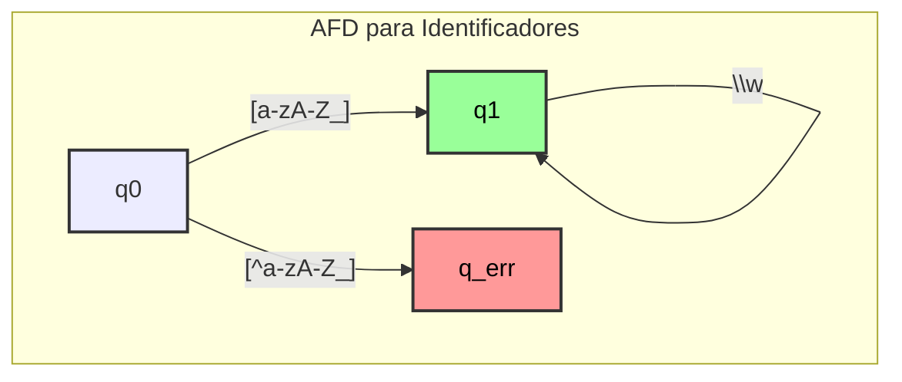

# Diagrama AFD para Identificadores (`afd_identifier`)

Este diagrama representa o AFD para reconhecer identificadores e palavras-chave, conforme implementado em `afd_identifier`. Um identificador deve começar com uma letra ou underscore, seguido por qualquer número de letras, dígitos ou underscores.

-   **q0**: Estado inicial.
-   **q1**: Estado de aceitação. É alcançado após ler um caractere inicial válido (letra ou `_`) e permanece neste estado enquanto lê caracteres válidos para um identificador. A verificação se o identificador é uma palavra-chave ocorre após a aceitação da sequência.

