# Diagrama AFD para Strings (`afd_string`)

Este diagrama representa o AFD para reconhecer literais de string, utilizando expressões regulares para descrever as transições. Ele lida com strings delimitadas por aspas duplas e sequências de escape.

-   **q0**: Estado inicial.
-   **q1**: Estado principal, indicando que o lexer está dentro de uma string.
-   **q2**: Estado de transição para lidar com sequências de escape (após encontrar uma `\`).
-   **q3**: Estado final de aceitação, alcançado após encontrar a aspa dupla de fechamento.
-   **q_err**: Estado de erro para strings não terminadas (quando o fim do arquivo é encontrado antes da aspa de fechamento).

```mermaid
graph LR
    subgraph AFD para Strings
        direction LR
        q0 -- "&quot;" --> q1;
        q1 -- "[^&quot;&#92;]" --> q1;
        q1 -- "&#92;" --> q2;
        q1 -- "&quot;" --> q3;
        q1 -- "EOF" --> q_err;
        q2 -- "." --> q1;
    end
    style q0 fill:#lightblue,stroke:#333,stroke-width:2px
    style q1 fill:#lightblue,stroke:#333,stroke-width:2px
    style q2 fill:#lightblue,stroke:#333,stroke-width:2px
    style q3 fill:#9f9,stroke:#333,stroke-width:2px
    style q_err fill:#f99,stroke:#333,stroke-width:2px
```

