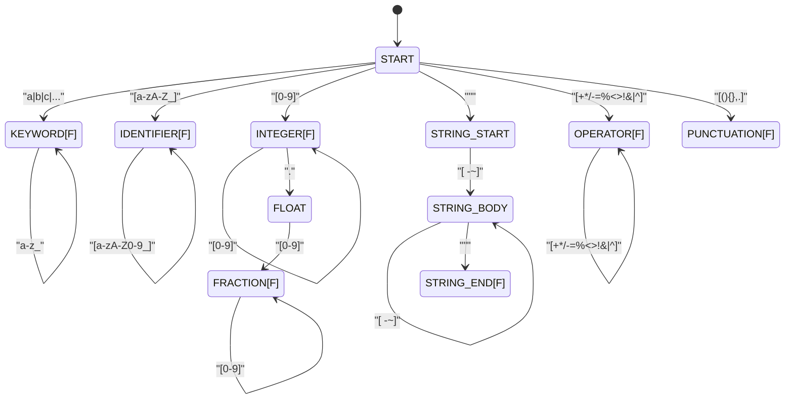

# Diagrama AFD Final

```mermaid
stateDiagram-v2
    [*] --> START

    %% Keywords
    START --> KEYWORD[F] : "a|b|c|..."
    KEYWORD[F] --> KEYWORD[F] : "a-z_"

    %% Identifiers
    START --> IDENTIFIER[F] : "[a-zA-Z_]"
    IDENTIFIER[F] --> IDENTIFIER[F] : "[a-zA-Z0-9_]"

    %% Numbers
    START --> INTEGER[F] : "[0-9]"
    INTEGER[F] --> INTEGER[F] : "[0-9]"
    INTEGER[F] --> FLOAT : "."
    FLOAT --> FRACTION[F] : "[0-9]"
    FRACTION[F] --> FRACTION[F] : "[0-9]"

    %% Strings
    START --> STRING_START : "&quot"
    STRING_START --> STRING_BODY : "[ -~]"
    STRING_BODY --> STRING_BODY : "[ -~]"
    STRING_BODY --> STRING_END[F] : "&quot"

    %% Operators
    START --> OPERATOR[F] : "[+*/-=%<>!&|^]"
    OPERATOR[F] --> OPERATOR[F] : "[+*/-=%<>!&|^]"

    %% Punctuation
    START --> PUNCTUATION[F] : "[(){},.]"
```