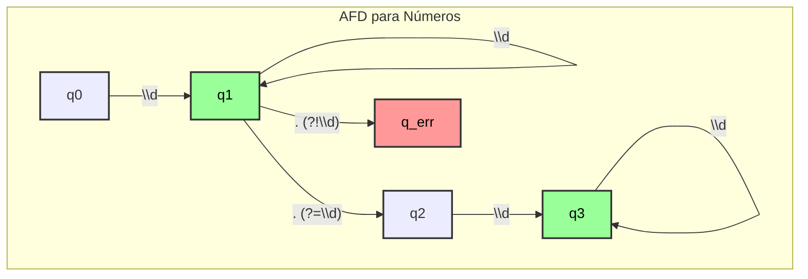

# Diagrama AFD para Números (`afd_number`)

Este diagrama representa o Autômato Finito Determinístico (AFD) para reconhecer números inteiros e de ponto flutuante, conforme implementado no método `afd_number`.

-   **q0**: Estado inicial.
-   **q1**: Estado de aceitação para **números inteiros**. O autômato chega aqui após ler um ou mais dígitos.
-   **q2**: Estado de transição após encontrar um ponto decimal. Este estado não é de aceitação; ele exige que um dígito venha a seguir.
-   **q3**: Estado de aceitação para **números de ponto flutuante**. O autômato chega aqui após ler um ponto decimal e um ou mais dígitos.
-   **q_err**: Estado de erro, alcançado se um ponto decimal não for seguido por um dígito.

