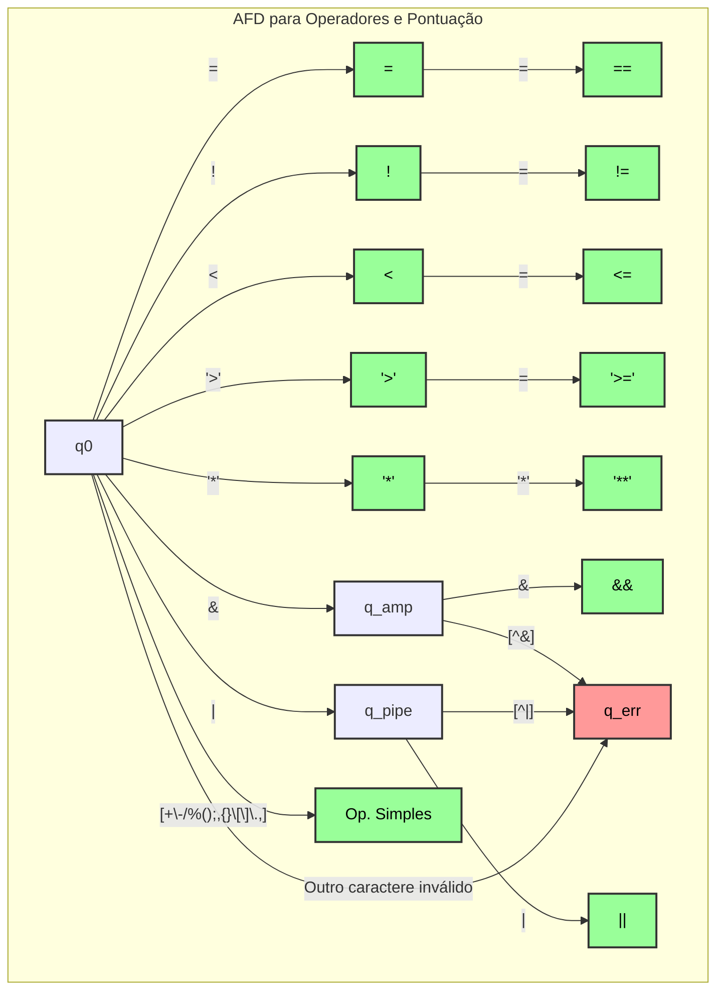

# Diagrama AFD para Operadores (`afd_operator`)

Este diagrama representa a lógica para reconhecer operadores usando notação Regex e incluindo a transição de erro, conforme a função `afd_operator`.

-   **q0**: Estado inicial.
-   **Estados Intermediários Não-Finais (azul claro)**: `q_amp` e `q_pipe`, para `&` e `|`.
-   **Estados de Aceitação (verde)**: Todos os outros estados que representam operadores válidos.
-   **q_err (vermelho)**: Estado de erro, alcançado se um caractere não puder iniciar nenhum operador válido.

